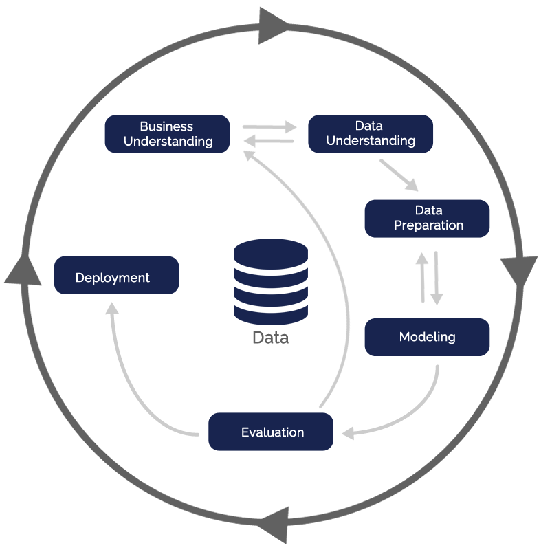

# Health Insurance Cross Sell 

This repository contains the codes to support an insurance company cross sell their products

	

# Project Context

The hypothetical Insurance All is a company that provides health insurance for its customers and the product team is analyzing the possibility of offering the insured a new product: an automobile insurance.
This insurance will be offered to customers by the sales team, which in turn has a limitation in the number of customers who can get in touch during the campaign. In this way, the Insurance All company requested that a forecast of customers with greater possibility of adhesion to the new product be carried out and, thus, the sales team can offer the product to customers strategically to maximize sales.

> - **The reason behind the request:** A model that predicts whether or not the client would be interested in car insurance
> - **Stackeholder:** Sales team
> - **Type of problem:** Cross sell
> - **Granularity:** Customer relationship
> - **Main methods:** Classification
> - **Delivery method**
>> - Dashboard with main Insights on the most relevant attributes of clients interested in acquiring a car insurance.
>> - API with the model, which will have data consumption both by bot in the telegram and by spreadsheet

## Business Questions

- What percentage of clients interested in purchasing auto insurance, will the sales team be able to contact by making 20,000 calls?
- And if the sales team's capacity increases to 40,000 calls, what percentage of customers interested in purchasing auto insurance will the sales team be able to contact?
- How many calls does the sales team need to make to contact 80% of the customers interested in purchasing auto insurance?

# Methodology

This project will be developed following the SCRUM methodology together with CRISP-DM. The deliveries will be iterative and incremental. Through these cyclic methodologies the data scientist will be able to deliver value faster and can improve the final delivery in each cycle of CRISP. It should be kept in mind that a sprint does not have the same duration as a CRISP cycle.

<a href="https://airtable.com/shrY6q2rIuUowLpyn">link to the kanban board of the tasks that were planned</a>

	

# About Data

- The data for this project was made available by Insurance All in the form of a database at AWS.

The database is composed of three tables, which have demographic information, the vehicle and the insurance policy for each client:
- **users** (Demographic Info)
> - id: unique customer identifier
> - gender: customer gender
> - age: customer age
> - region_code: customer region code
> - police_sales_channel: anonymous code for the customer contact channel

- **vehicle** (vehicle info)
> - id: unique customer identifier
> - driving_license: flag to indicate whether or not the client has a drive license
> - vehicle_age: vehicle age 
> - vehicle_damage: flag to indicate if the client has had the car damaged in the past

- inserance (policy info)
> - id: unique customer identifier
> - previously_insured: flag to indicate if the customer has car insurance
> - annual_premium: amount the client paid the company for the annual health insurance
> - vintage: number of days that the client joined the company through the purchase of health insurance
> - response: flag to indicate whether the client is interested in car insurance or not

Entity Relashionship Diagram of the Schema:

	

